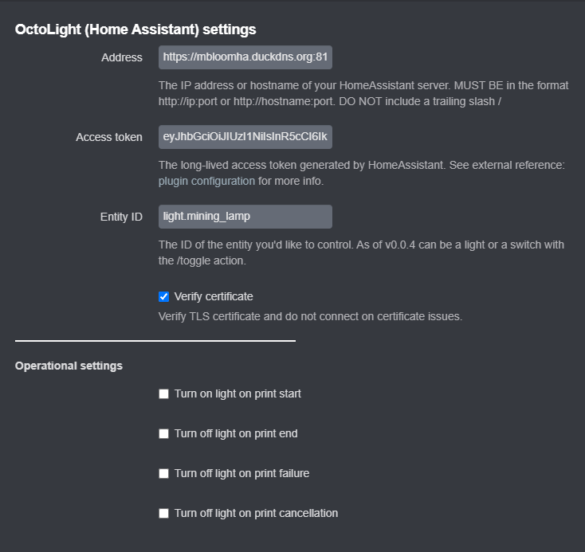

# OctoLight Home Assistant
A simple plugin that adds a button to the navigation bar for toggling a HomeAssistant connected Light.

Code forked from [OctoLight by gigibu5](https://github.com/gigibu5/OctoLight) with HA integration based on [OctoPrint-PSUControl by kantlivelong](https://github.com/kantlivelong/OctoPrint-PSUControl)

## Setup
Install via the bundled [Plugin Manager](https://docs.octoprint.org/en/master/bundledplugins/pluginmanager.html) or manually using this URL:

        https://github.com/mark-bloom/OctoLight_Home-Assistant/archive/master.zip

## Configuration
Curently, you can configure 8 settings, including 4 configuration items:
- `Address`: The IP address or hostname of your HomeAssistant server. e.g. http://ip:port or http://hostname:port. Do not include a trailing slash /

- `Access token`: The long-lived access token generated by HomeAssistant.

- `Entity ID`: The Home Assistant ID of the entity you'd like to control. Currently must be a light device supporting the light/toggle action.

- `Verify certificate`: Toggle on to verify TLS certificate and not connect on certificate issues (keep disabled if using http on local network).

### Operational settings
- `Turn on light on print start`: Turn on the light when OctoPrint receives a "print started" message.

- `Turn off light on print end`: Turn off the light when OctoPrint receives a "print complete" message.

- `Turn off light on print failure`: Turn off the light when OctoPrint receives a "print failure" message.

- `Turn off light on print cancellation`: Turn off the light when OctoPrint receives a "print cancellation" message.

## API
**UNTESTED in HA MOD**
Base API URL : `GET http://YOUR_OCTOPRINT_SERVER/api/plugin/octolight?action=ACTION_NAME`

This API always returns updated light state in JSON: `{state: true}`

_(if the action parameter not given, the action toggle will be used by default)_
#### Actions
- **toggle** (default action): Toggle light switch on/off.
- **turnOn**: Turn on light.
- **turnOff**: Turn off light.
- **getState**: Get current light switch state.

## TO DO
- [x] Update interface if Light is turned on or off

Maybe in the distant future:
- [ ] Turn off on finish print
